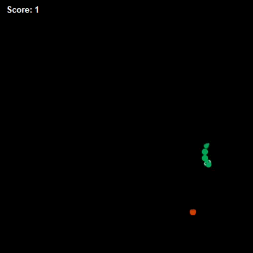

# Snake Game with Qt

Это приложение — модификация классической игры «Змейка», написанная с использованием фреймворка Qt. Змейка движется по полю под углом, заданным пользователем и собирает яблоки, увеличивая свою длину. Вычисление текущих координат змейки выполняются с помощью матриц с использованием аффинных преобразований.

## Функционал
- Угол движения змейки, который задаётся с помощью клавиш влево и вправо.
- Повороты головы и хвоста змейки.
- Сбор яблок, увеличивающий длину змейки.
- Реализация паузы для временной приостановки игры.
- Защита от «залипания» клавиш для корректных поворотов — учитываются только реальные нажатия.

## Зависимости
- Qt 5 или выше
- Компилятор с поддержкой C++ 17
- CMake 3.14 или выше
- Для ускорения процесса сборки рекомендуется использовать Ninja как генератор

## Установка и сборка
1. **Клонируйте репозиторий**:
    ```bash
    git clone https://github.com/sargylana108/snake2
    cd snake2
    ```

2. **Соберите проект с помощью CMake и Ninja**:
    ```bash
    mkdir build
    cd build
    cmake -G Ninja ..
    ninja
    ```

3. **Запустите собранное приложение**:
    ```bash
    ./SnakeGame2
    ```

## Использование

### Управление
- **Стрелка влево** — поворот змейки влево.
- **Стрелка вправо** — поворот змейки вправо.
- **Клавиша `P`** — пауза игры.
- **Клавиша `Enter`** — перезапуск игры после проигрыша.

### Правила
Игра начинается с короткой змейки из трёх сегментов. На игровом поле случайным образом появляются яблоки. Цель игры — съесть как можно больше яблок. С каждым съеденным яблоком змейка становится длиннее на один сегмент.
Игра заканчивается, если змейка сталкивается с собой или с границами поля. Игра учитывает только реальные нажатия кнопок.

### Описание кода

#### Структура проекта

```
project_root/
├── assets/                    # Папка со скриншотом для документации
├── src/
│   ├── main.cpp               # Основной файл приложения
│   ├── snake.h                # Заголовочный файл класса SnakeGame
│   └── snake.cpp              # Реализация класса SnakeGame, логика
├── images/                    # Папка с изображениями головы, сегмента тела, хвоста и яблока
├── resources.qrc              # Файл для подключения изображений
├── CMakeLists.txt             # Конфигурационный файл для сборки 
└── .gitignore
```

Используется пространство имен `SnakeNamespace` для изоляции классов и предотвращения конфликтов имен.

- **Основные функции класса `SnakeGame`:**
  - `initGame()`: Инициализирует новую игру.
  - `move()`: Обновляет координаты змейки и перемещает ее в направлении текущего угла.
  - `checkCollision()`: Проверяет столкновения с границами или телом.
  - `locateApple()`: Размещает яблоко на игровом поле.
  - `togglePause()`: Управляет состоянием паузы.
  - `paintEvent()`: Отрисовывает змейку, яблоко и очки.
  
### Пример экрана игры


## Лицензия
Этот проект распространяется под лицензией MIT. 